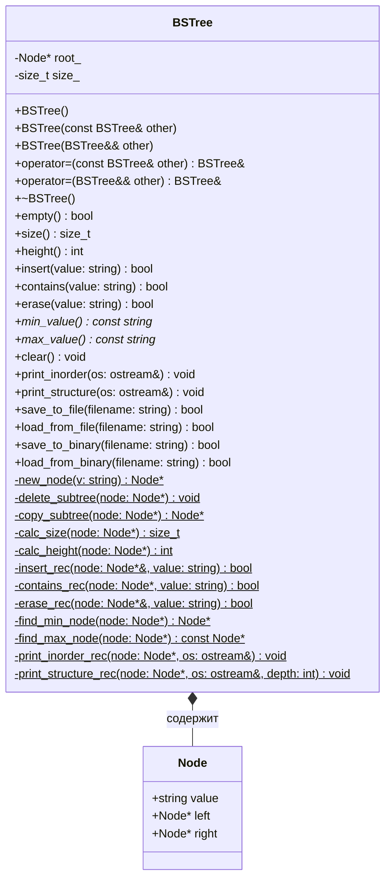
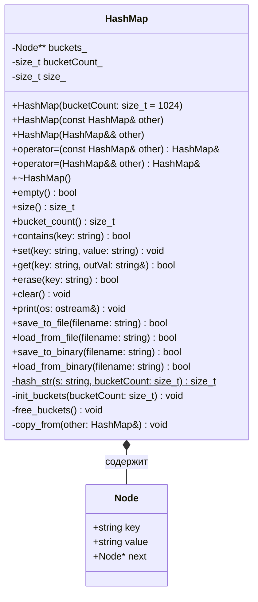
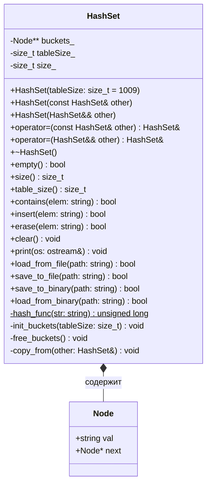
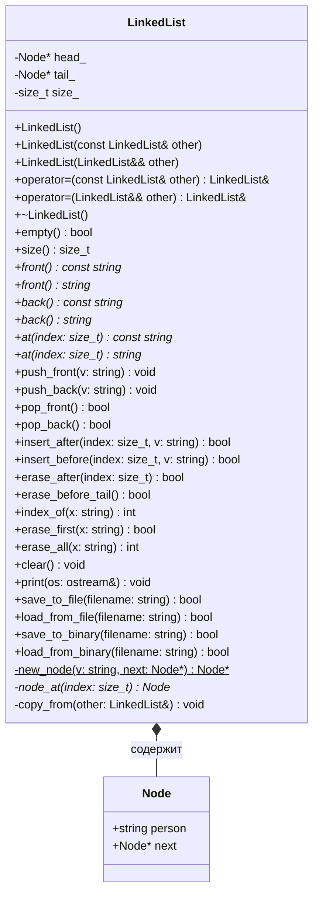
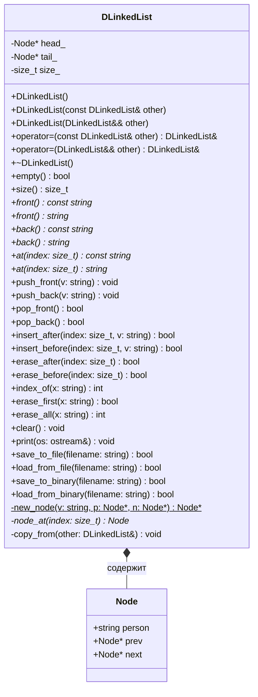
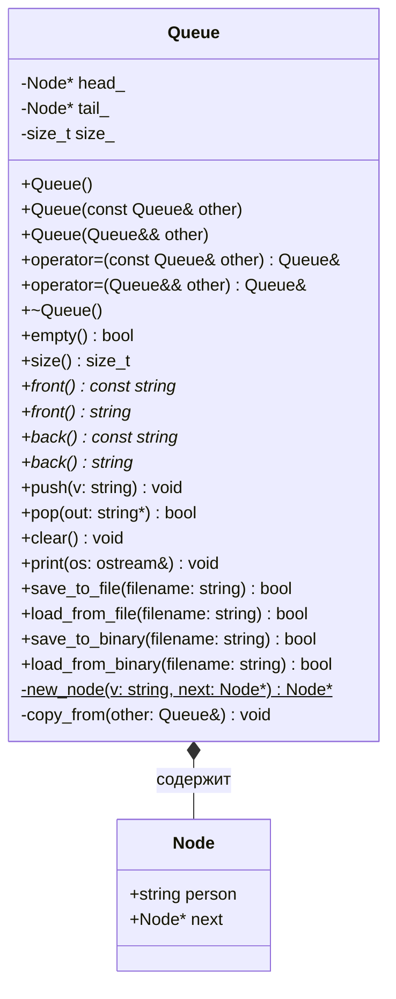
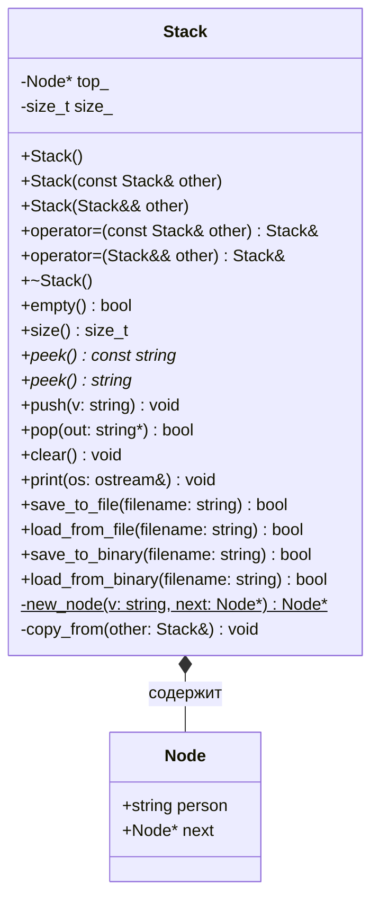

# UML Диаграммы Классов - Структуры Данных

Для просмотра диаграмм:
1. Откройте этот файл на GitHub (диаграммы отобразятся автоматически)
2. Или скопируйте код диаграммы и вставьте на [mermaid.live](https://mermaid.live)
3. Или используйте расширение для браузера/редактора с поддержкой Mermaid

---

## 1. BSTree - Бинарное Дерево Поиска



**Описание:**
- Бинарное дерево поиска с автоматическим балансированием
- Поддерживает операции вставки, поиска, удаления за O(log n) в среднем
- Имеет методы для сохранения/загрузки в текстовом и бинарном форматах

---

## 2. HashMap - Хеш-Таблица (Словарь)



**Описание:**
- Хеш-таблица с методом цепочек для разрешения коллизий
- Хранит пары ключ-значение
- Средняя сложность операций O(1)

---

## 3. HashSet - Хеш-Множество



**Описание:**
- Хеш-множество для хранения уникальных значений
- Быстрая проверка наличия элемента
- Использует метод цепочек для коллизий

---

## 4. LinkedList - Односвязный Список



**Описание:**
- Односвязный список с указателями на голову и хвост
- Быстрая вставка в начало O(1)
- Доступ по индексу O(n)

---

## 5. DLinkedList - Двусвязный Список



**Описание:**
- Двусвязный список с указателями вперед и назад
- Быстрая вставка/удаление в начале и конце O(1)
- Более гибкое удаление по сравнению с односвязным списком

---

## 6. Queue - Очередь (FIFO)



**Описание:**
- FIFO (First In First Out) - первым пришел, первым вышел
- Вставка в конец, удаление из начала
- Все операции O(1)

---

## 7. Stack - Стек (LIFO)



**Описание:**
- LIFO (Last In First Out) - последним пришел, первым вышел
- Вставка и удаление только с вершины
- Все операции O(1)

---

## Сводная Таблица Сложности Операций

| Структура | Вставка | Поиск | Удаление | Доступ по индексу |
|-----------|---------|-------|----------|-------------------|
| BSTree | O(log n) | O(log n) | O(log n) | - |
| HashMap | O(1) сред. | O(1) сред. | O(1) сред. | - |
| HashSet | O(1) сред. | O(1) сред. | O(1) сред. | - |
| LinkedList | O(1) начало<br>O(n) середина | O(n) | O(1) начало<br>O(n) середина | O(n) |
| DLinkedList | O(1) начало/конец<br>O(n) середина | O(n) | O(1) начало/конец<br>O(n) середина | O(n) |
| Queue | O(1) | - | O(1) | - |
| Stack | O(1) | - | O(1) | - |

---

## Использование

### Как просмотреть диаграммы:

1. **GitHub**: Просто откройте этот файл на GitHub - диаграммы отобразятся автоматически

2. **Mermaid Live Editor**:
   - Перейдите на https://mermaid.live
   - Скопируйте код диаграммы (блок между \`\`\`mermaid и \`\`\`)
   - Вставьте в редактор
   - Скачайте как PNG/SVG

3. **VS Code**:
   - Установите расширение "Markdown Preview Mermaid Support"
   - Откройте этот файл и нажмите Ctrl+Shift+V

4. **Командная строка** (если установлен mermaid-cli):
   ```bash
   npm install -g @mermaid-js/mermaid-cli
   mmdc -i UML_Diagrams.md -o diagrams.png
   ```
